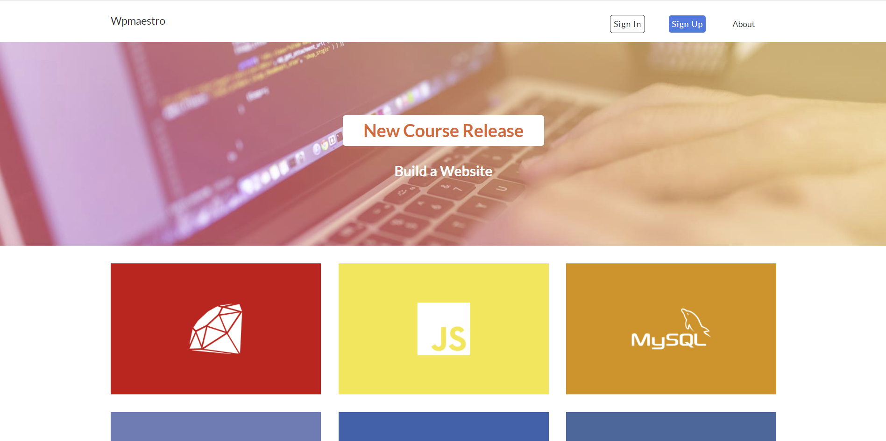
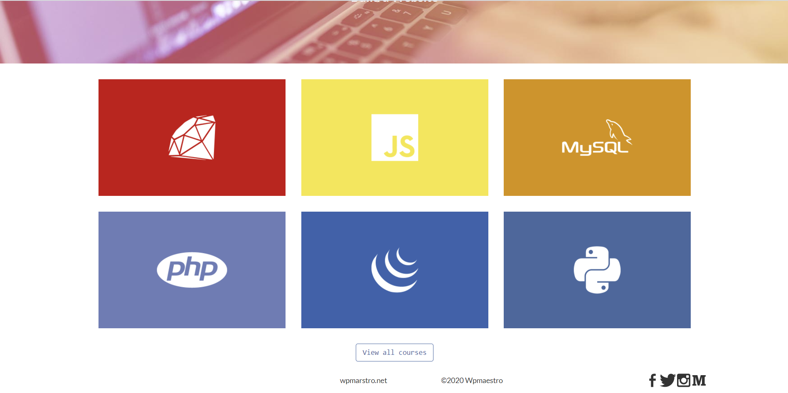

# simple-bootstrap
Homepage by using simple bootstrap.
This is a simple portfolio page created by using some of the common classes of bootstrap & some custom CSS as well.

Screenshot no1 :

here are some class we use here : 

***container
*row
*col-sm-8
*col-sm-4
*col-sm-6
*col-sm-1
*jumbotron
*text-center
*text-right
*text-left
*btn
*btn-primary
*pill-white
*pill-black**

Also we used a javaScript loader gif which will keep loading until all of my stylesheet runs. 
to use this JavaScript we used a id name #loading and created a function in JavaScript myFunction();

Screenshot no 2:

